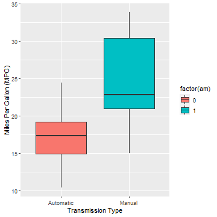
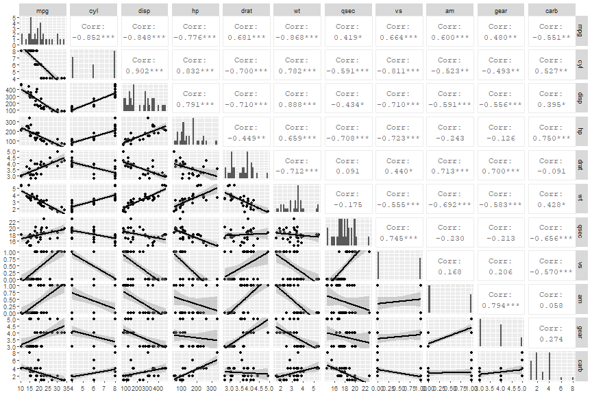
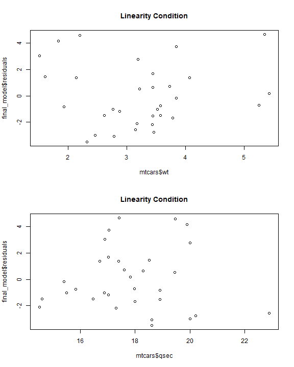
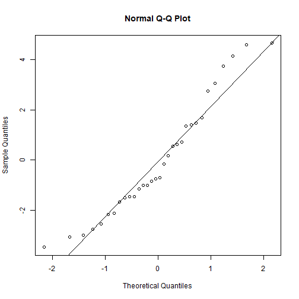

# Overview  

You work for Motor Trend, a magazine about the automobile industry. Looking at a data set of a collection of cars, they are interested in exploring the relationship between a set of variables and miles per gallon (MPG) (outcome).  

They are particularly interested in the following two questions:  

* “Is an automatic or manual transmission better for MPG”
* "Quantify the MPG difference between automatic and manual transmissions"

# Executive Summary  
What I plan to figure out during the following analysis is whether or not the type of transmission of a car has an affect on gas mileage or miles per gallon (MPG). Linear regression and multivariate regression will be used to test the effectiveness of tranmission type, but also rule out other factors of a car i.e. cylinder type, horsepower, engine type, etc. With this knowledge we at Motor Trend magazine can better help our readers understand specific factors that might factor into their next car purchase.  

# Hypothesis  

## Null Hypothesis  
Transmission type will have no affect on the MPG rate of a car.  

## Alternative Hypotheses  
* Automatic cars will have a better MPG rate than that of manaul cars.
* Tranmission type will be more correlated with MPG than any other variable in the data set.  

# Methodology/Code   
First the libraries and data need to be loaded in.  

```r
library(ggplot2)
library(stats)
library(GGally)
library(regclass)
library(MASS)
data(mtcars)
```
The data is a data frame of 32 observations of 11 variables.  


```r
dim(mtcars)
```

```
## [1] 32 11
```

The summary of each variable.  


```r
summary(mtcars)
```

```
##       mpg             cyl             disp             hp             drat             wt             qsec      
##  Min.   :10.40   Min.   :4.000   Min.   : 71.1   Min.   : 52.0   Min.   :2.760   Min.   :1.513   Min.   :14.50  
##  1st Qu.:15.43   1st Qu.:4.000   1st Qu.:120.8   1st Qu.: 96.5   1st Qu.:3.080   1st Qu.:2.581   1st Qu.:16.89  
##  Median :19.20   Median :6.000   Median :196.3   Median :123.0   Median :3.695   Median :3.325   Median :17.71  
##  Mean   :20.09   Mean   :6.188   Mean   :230.7   Mean   :146.7   Mean   :3.597   Mean   :3.217   Mean   :17.85  
##  3rd Qu.:22.80   3rd Qu.:8.000   3rd Qu.:326.0   3rd Qu.:180.0   3rd Qu.:3.920   3rd Qu.:3.610   3rd Qu.:18.90  
##  Max.   :33.90   Max.   :8.000   Max.   :472.0   Max.   :335.0   Max.   :4.930   Max.   :5.424   Max.   :22.90  
##        vs               am              gear            carb      
##  Min.   :0.0000   Min.   :0.0000   Min.   :3.000   Min.   :1.000  
##  1st Qu.:0.0000   1st Qu.:0.0000   1st Qu.:3.000   1st Qu.:2.000  
##  Median :0.0000   Median :0.0000   Median :4.000   Median :2.000  
##  Mean   :0.4375   Mean   :0.4062   Mean   :3.688   Mean   :2.812  
##  3rd Qu.:1.0000   3rd Qu.:1.0000   3rd Qu.:4.000   3rd Qu.:4.000  
##  Max.   :1.0000   Max.   :1.0000   Max.   :5.000   Max.   :8.000
```

Now let's look at the variables we most want to look at. The following box plot shows that manual transmission has a higher MPG rate than that of automatic transmission which rejects our hypothesis and the null, but we need to dig further to make sure that this is correct. It also answers the first question posed by the project.   


```r
ggplot(mtcars, aes(x=factor(am, labels = c('Automatic', 'Manual')), y=mpg, fill = factor(am))) +
        geom_boxplot() + xlab('Transmission Type') + ylab('Miles Per Gallon (MPG)')
```



The following plots give us a general idea of the correlation and effects of each varaible against the others.  

```r
ggpairs(mtcars, columns = 1:ncol(mtcars), lower = list(continuous = "smooth", colour = "blue"),
        upper = list(corSize = 15), 
        diag = list(continuous = "barDiag", colour = "blue"))
```



There are two variables in the data set that should be factored out. "am" and "vs" are both binary variables (having values of either 0 or 1) so we can split them into what the 0 or 1 represents. For "am we split into automatic and manual transmission, and for "vs" v shape and straight shape.  


```r
mtcars$transmission <- factor(mtcars$am, labels = c('automatic', 'manual'))
mtcars$engine <- factor(mtcars$vs, labels = c('v', 'stright'))
```

The next runs a T-test on the newly created transmission variable and its affect on MPG. The P-value is <.05 allowing us to reject the null hypothesis that transmission type would have no affect on MPG rate.  


```r
t.test(mpg ~ transmission, data = mtcars, var.equal = F, conf.level = .95)
```

```
## 
## 	Welch Two Sample t-test
## 
## data:  mpg by transmission
## t = -3.7671, df = 18.332, p-value = 0.001374
## alternative hypothesis: true difference in means is not equal to 0
## 95 percent confidence interval:
##  -11.280194  -3.209684
## sample estimates:
## mean in group automatic    mean in group manual 
##                17.14737                24.39231
```

Now we can check the regression statistic for transmission on MPG as well.  


```r
summary(lm(mpg ~ transmission, data = mtcars))$coef
```

```
##                     Estimate Std. Error   t value     Pr(>|t|)
## (Intercept)        17.147368   1.124603 15.247492 1.133983e-15
## transmissionmanual  7.244939   1.764422  4.106127 2.850207e-04
```

According to the model, specifically the P-value, tranmission type is a significant indicator for MPG rate. This may not be the only contributing factor though. We need to figure out if any other of the variables of the data set are equally or more significant than the one we are testing.  


```r
model <- lm(mpg ~ transmission+disp+hp+drat+wt+qsec+engine+cyl+gear+carb, data = mtcars)
summary(model)$coef
```

```
##                       Estimate  Std. Error    t value   Pr(>|t|)
## (Intercept)        12.30337416 18.71788443  0.6573058 0.51812440
## transmissionmanual  2.52022689  2.05665055  1.2254035 0.23398971
## disp                0.01333524  0.01785750  0.7467585 0.46348865
## hp                 -0.02148212  0.02176858 -0.9868407 0.33495531
## drat                0.78711097  1.63537307  0.4813036 0.63527790
## wt                 -3.71530393  1.89441430 -1.9611887 0.06325215
## qsec                0.82104075  0.73084480  1.1234133 0.27394127
## enginestright       0.31776281  2.10450861  0.1509915 0.88142347
## cyl                -0.11144048  1.04502336 -0.1066392 0.91608738
## gear                0.65541302  1.49325996  0.4389142 0.66520643
## carb               -0.19941925  0.82875250 -0.2406258 0.81217871
```


```r
summary(model)$r.squared
```

```
## [1] 0.8690158
```

The regression model supports the transmission hypothesis as well with an ~87% accuracy rate. There is a lot of noise though with nine other variables so we need to figure out which ones have the most effect, negative or positive. This is where the variation inflation factors (VIF) test comes into play.  


```r
VIF(model)
```

```
## transmission         disp           hp         drat           wt         qsec       engine          cyl         gear 
##     4.648487    21.620241     9.832037     3.374620    15.164887     7.527958     4.965873    15.373833     5.357452 
##         carb 
##     7.908747
```

Any variable over 10 is considered to be large so we can ignore all but one of those values to exclude colinearity issues. We still need to sort out which variables to keep though, for that we will use a stepwise method.  


```r
step <- stepAIC(model, direction = "both", trace = FALSE)
summary(step)$coef
```

```
##                     Estimate Std. Error   t value     Pr(>|t|)
## (Intercept)         9.617781  6.9595930  1.381946 1.779152e-01
## transmissionmanual  2.935837  1.4109045  2.080819 4.671551e-02
## wt                 -3.916504  0.7112016 -5.506882 6.952711e-06
## qsec                1.225886  0.2886696  4.246676 2.161737e-04
```


```r
summary(step)$r.squared
```

```
## [1] 0.8496636
```

With an ~85% accuracy the three variables that make the best model are transmission type, weight, and quarter mile time. We can also assess the accuracy of this with the following anova regression models.


```r
fit1 <- lm(mpg ~ factor(am), data = mtcars)
fit2 <- lm(mpg ~ factor(am) + wt, data = mtcars)
fit3 <- lm(mpg ~ factor(am) + wt + qsec, data = mtcars)
anova(fit1, fit2, fit3)
```

```
## Analysis of Variance Table
## 
## Model 1: mpg ~ factor(am)
## Model 2: mpg ~ factor(am) + wt
## Model 3: mpg ~ factor(am) + wt + qsec
##   Res.Df    RSS Df Sum of Sq      F    Pr(>F)    
## 1     30 720.90                                  
## 2     29 278.32  1    442.58 73.203 2.673e-09 ***
## 3     28 169.29  1    109.03 18.034 0.0002162 ***
## ---
## Signif. codes:  0 '***' 0.001 '**' 0.01 '*' 0.05 '.' 0.1 ' ' 1
```


```r
fit4 <- lm(mpg ~ factor(am) + wt + qsec + hp, data = mtcars)
fit5 <- lm(mpg ~ factor(am) + wt + qsec + hp + drat, data = mtcars)
anova(fit1, fit2, fit3, fit4, fit5)
```

```
## Analysis of Variance Table
## 
## Model 1: mpg ~ factor(am)
## Model 2: mpg ~ factor(am) + wt
## Model 3: mpg ~ factor(am) + wt + qsec
## Model 4: mpg ~ factor(am) + wt + qsec + hp
## Model 5: mpg ~ factor(am) + wt + qsec + hp + drat
##   Res.Df    RSS Df Sum of Sq      F    Pr(>F)    
## 1     30 720.90                                  
## 2     29 278.32  1    442.58 72.536 5.362e-09 ***
## 3     28 169.29  1    109.03 17.870 0.0002579 ***
## 4     27 160.07  1      9.22  1.511 0.2299925    
## 5     26 158.64  1      1.43  0.234 0.6326111    
## ---
## Signif. codes:  0 '***' 0.001 '**' 0.01 '*' 0.05 '.' 0.1 ' ' 1
```

The anova stats from these two tests show that the three main variables are significant and any excess variables are not (shown by fit4 and fit5).  

# Results

## Final Model

That brings us to our final model and final analysis of the data.  


```r
final_model <- lm(mpg ~ wt + transmission + qsec, data = mtcars)
summary(final_model)$coef
```

```
##                     Estimate Std. Error   t value     Pr(>|t|)
## (Intercept)         9.617781  6.9595930  1.381946 1.779152e-01
## wt                 -3.916504  0.7112016 -5.506882 6.952711e-06
## transmissionmanual  2.935837  1.4109045  2.080819 4.671551e-02
## qsec                1.225886  0.2886696  4.246676 2.161737e-04
```

So, on average, the manual transmission cars have 2.94 MPGs more than automatic transmission cars which reject both the null and alternative hypothesis but does support that transmission does play a pivotal role in MPG. The following are supportive plots that take a look at the residuals of the model further supporting the analysis made in this project.  


```r
par(mfrow=c(2,1))
plot(final_model$residuals ~ mtcars$wt + mtcars$qsec, main = "Linearity Condition")
```




```r
qqnorm(final_model$residuals)
qqline(final_model$residuals)
```




